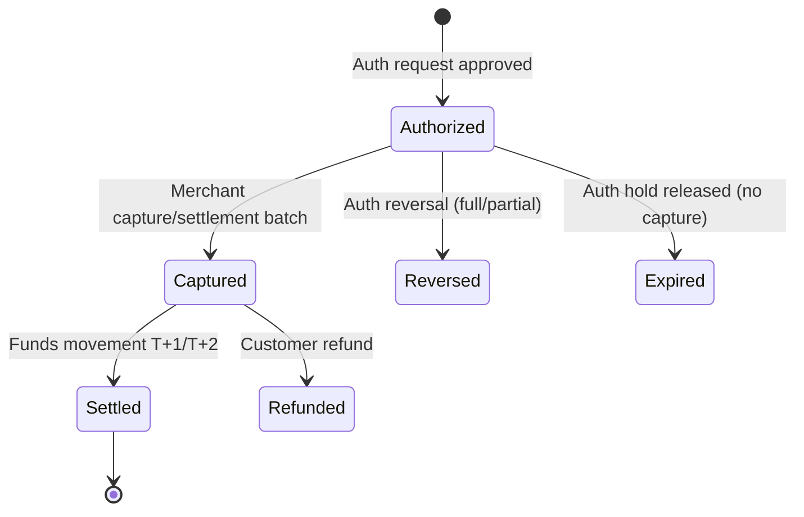
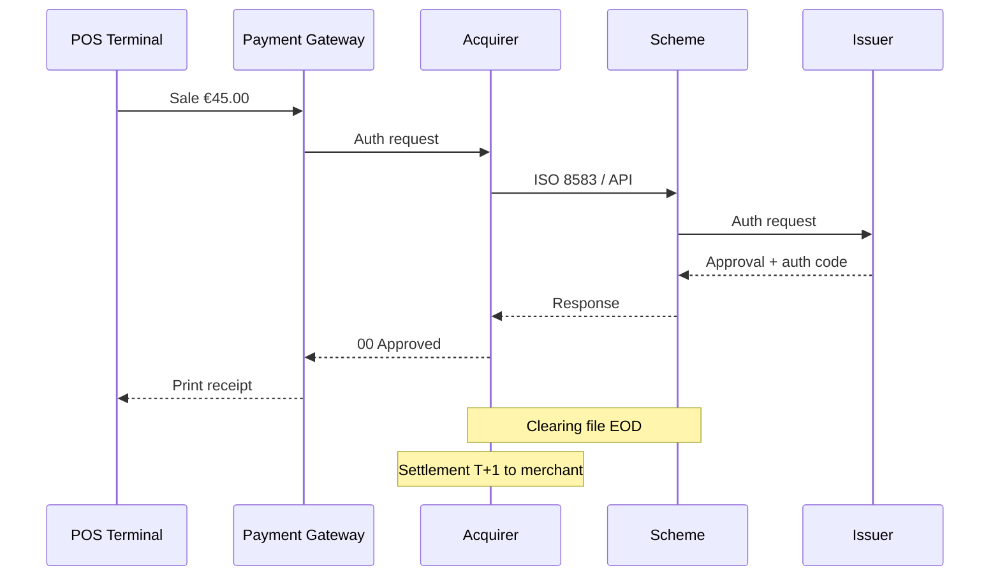

# Domain Overview — Payments & POS

## 1. Payment Transaction Lifecycle

## 2. Ecosystem Actors

| Actor | Responsibility |
|-------|----------------|
| **Cardholder** | Pays with physical or virtual card |
| **Merchant** | Accepts payment for goods/services |
| **POS / Payment Gateway** | Captures card data, routes to acquirer |
| **Acquirer** | Merchant relationship, clearing to scheme |
| **Scheme** | Visa, Mastercard — rules and network |
| **Issuer** | Cardholder account, authorization decision |
| **Processor** | Technical auth/clearing switch |

## 3. Card-Present vs Card-Not-Present

| Dimension | Card-Present (POS) | Card-Not-Present (eCom) |
|-----------|-------------------|-------------------------|
| Entry mode | Chip, contactless, swipe | PAN entry, tokenized wallet |
| Liability | EMV shift if chip used | 3DS, AVS, CVV rules |
| Failure modes | Terminal offline store-and-forward | Timeout, duplicate submit |
| Settlement | Often batch per terminal EOD | Real-time or batch capture |

## 4. Message Flow (Simplified)

## 5. Initiative Scope — Unified Payment Gateway

Fictional merchant platform **PayRoute** consolidates POS, eCom, and mobile SDK into one gateway with consistent idempotency, reporting, and failure handling.

## 6. Success Criteria

- Auth p95 latency < 800ms domestic
- Duplicate charge rate < 0.01%
- Terminal offline transactions reconciled within 24h
- Merchant-visible status for auth → capture → settlement
